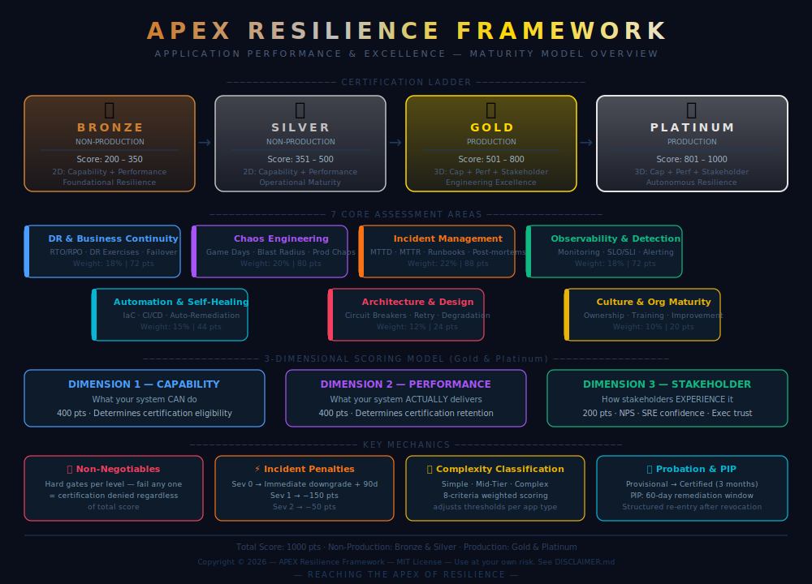

# 🏆 APEX Resilience Framework
### *Application Performance & EXcellence — Enterprise Resilience Maturity Model*

[](https://opensource.org/licenses/MIT)
[]()
[]()
[]()

---

> ⚠️ **IMPORTANT DISCLAIMER**
> This framework is provided as a reference model and educational resource only.
> It does not guarantee any specific resilience outcomes. Any implementation in
> production environments is entirely at your own risk. The author accepts no
> liability for incidents, outages, data loss, or any other damage arising from
> use of this framework. Chaos engineering practices in particular carry inherent
> production risk and must not be attempted without proper safeguards.
> **See [DISCLAIMER.md](./DISCLAIMER.md) for full terms before using this framework.**

---



## 🎯 What is APEX?

**APEX** is a comprehensive, practical, and implementable **Resilience Maturity Model** designed for modern software engineering organisations. It provides a structured, measurable path from foundational resilience in non-production environments all the way to autonomous, self-healing production systems.

Unlike theoretical frameworks, APEX is built for real-world engineering teams with hard gates that prevent gaming, a dynamic scoring engine that responds to live incidents, and a 3-dimensional scoring model that captures not just what you *can* do, but what you *actually deliver* and how your *stakeholders experience* it.

> *"Reaching the APEX of Resilience"*

---

## 📊 The APEX Certification Ladder

| Level | Environment | Score Range | Dimensions | Philosophy |
|-------|-------------|-------------|------------|------------|
| 🥉 **Bronze** | Non-Production | 200–350 / 1000 | Capability + Performance | Foundational: get started |
| 🥈 **Silver** | Non-Production | 351–500 / 1000 | Capability + Performance | Operational maturity: production-grade discipline |
| 🥇 **Gold** | Production | 501–800 / 1000 | Capability + Performance + Stakeholder | Engineering excellence: real production resilience |
| 🏆 **Platinum** | Production | 801–1000 / 1000 | Capability + Performance + Stakeholder | Autonomous resilience: systems defend themselves |

---

## 🏗️ Framework Architecture

### 7 Core Assessment Areas

```
                        DR & Business Continuity (72 pts)
                                ↑
Culture & Org Maturity ←    APEX     → Chaos Engineering (80 pts)
      (20 pts)          Resilience
                         Score        Incident Management (88 pts)
                                ↓
              Architecture   Observability   Automation
               & Design      & Detection    & Self-Healing
               (24 pts)      (72 pts)        (44 pts)
```

| # | Category | Weight | Key Focus |
|---|----------|--------|-----------|
| 1 | **DR & Business Continuity** | 18% | RTO/RPO, DR exercises, failover automation |
| 2 | **Chaos Engineering & Resilience Testing** | 20% | Game days, blast radius control, production chaos |
| 3 | **Incident Management & Response** | 22% | MTTD, MTTR, runbooks, post-mortems |
| 4 | **Observability & Detection** | 18% | Monitoring coverage, SLO/SLI, alerting quality |
| 5 | **Automation & Self-Healing** | 15% | IaC %, CI/CD maturity, auto-remediation |
| 6 | **Architecture & Design Resilience** | 12% | Circuit breakers, retry logic, graceful degradation |
| 7 | **Culture & Organizational Maturity** | 10% | Resilience ownership, training, continuous improvement |

### 3-Dimensional Scoring (Gold & Platinum)

```
┌─────────────────────────────────────────┐
│  DIMENSION 1: Capability Score (400 pts) │  ← What you CAN do
│  DIMENSION 2: Performance Score (400 pts)│  ← What you ACTUALLY deliver
│  DIMENSION 3: Stakeholder Score (200 pts)│  ← How stakeholders EXPERIENCE it
│                                          │
│  TOTAL: 1000 pts                         │
└─────────────────────────────────────────┘
```

---

## 🔒 Non-Negotiables System

Every certification level has hard-gate non-negotiables, criteria that, if failed, deny certification regardless of total score. This prevents teams from gaming the system by scoring high in easy categories while ignoring critical gaps.

**Example Non-Negotiables:**
- **Bronze**: DR plan documented, basic monitoring >50%, rollback capability exists
- **Silver**: Chaos tests in non-prod monthly, MTTD <30 min, SLOs defined
- **Gold**: Production chaos mandatory monthly, Sev 0 = immediate cap at Silver
- **Platinum**: Autonomous remediation >60%, NPS ≥65, zero Sev 0 in 12 months

> *A Sev 0 incident is an unconditional cap at Silver — even a score of 780 becomes Silver the moment a Sev 0 lands.*

---

## ⚡ Dynamic Scoring & Incident Impact

APEX scores are not static, live incidents modify certification status in real time:

| Event | Impact |
|-------|--------|
| Sev 0 Incident | Immediate downgrade one level + 90-day probation |
| Sev 1 Incident | −150 points |
| Sev 2 Incident | −50 points |
| >3 Sev 3/month | −100 points aggregate |
| NPS >70 | +50 points |
| Zero customer incidents (90 days) | +100 points |

### Certification States
- **Provisional** → Probation Period (PP): 3 months of sustained performance required
- **Certified** → Full certification, 6-month validity
- **Performance Improvement Plan (PIP)**: 60-day remediation window
- **Revoked** → Structured re-entry path with escalating bars for repeat failures

---

## 📁 Repository Structure

```
apex-resilience-framework/
│
├── README.md                                      # This file
├── LICENSE                                        # MIT License
├── DISCLAIMER.md                                  # IP & production use disclaimer
│
├── frameworks/
│   ├── APEX-BRONZE-CERTIFICATION-FRAMEWORK-v1.1.md   # Non-Prod: Foundational
│   ├── APEX-SILVER-CERTIFICATION-FRAMEWORK-v1.1.md   # Non-Prod: Advanced
│   ├── APEX-GOLD-CERTIFICATION-FRAMEWORK-v1.1.md     # Production: Excellence
│   └── APEX-PLATINUM-CERTIFICATION-FRAMEWORK-v1.0.md # Production: Autonomous
│
├── assets/
│   └── apex-framework-overview.svg               # Framework overview diagram
│
└── tools/
    └── apex-spider-chart.html                    # Interactive assessment tool
```

---

## 🕸️ Interactive Spider Chart Tool

The repository includes a fully interactive **APEX Spider Chart** (`tools/apex-spider-chart.html`) that allows you to:

- **Score any application** across all 7 capability categories using live sliders
- **Visualise** the radar chart with Bronze/Silver/Gold/Platinum zone rings
- **See real-time certification** badge updates as scores change
- **Load pre-built scenarios**: Banking Payment System (Platinum), E-Commerce Checkout (Gold), API Gateway (Silver), Internal Dashboard (Bronze)
- **Validate dimension floors**: Live green/red checks for Capability, Performance, and Stakeholder minimums
- **Simulate incident impact**: Drag scores down and watch certification level change instantly

**How to run:** Simply open `tools/apex-spider-chart.html` in any modern browser — no build step, no dependencies.

---

## 🔢 Complexity Classification

Before assessment, applications are classified using an **8-Criteria Weighted Scoring System** (0–80 points):

| Criteria | Weight | Factors |
|----------|--------|---------|
| Component Count | 2x | Number of services/microservices |
| Business Tier | 3x | Tier 0 (mission-critical) → Tier 5 (non-critical) |
| Team Dependencies | 1.5x | Number of teams involved |
| Outage Impact | 3x | Severity classification if application fails |
| Data Complexity | 2x | Number and type of data stores |
| External Dependencies | 1.5x | Third-party integrations and vendors |
| Transaction Volume | 2x | Requests per minute at peak |
| Geographic Distribution | 1x | Regions and availability zones |

| Complexity Level | Score Range | Example |
|-----------------|-------------|---------|
| Simple | 0–25 | Internal dashboard, marketing site |
| Mid-Tier | 26–50 | E-commerce platform, customer portal |
| Complex | 51–80 | Banking payment system, trading platform |

---

## 📈 Application Profiles

Each application is assigned a **profile** that applies weight multipliers to relevant categories, ensuring fair assessment across different application types:

| Profile | Boosted Categories | Typical Use Case |
|---------|-------------------|------------------|
| High-Velocity | Deployment automation (2x), Chaos testing (1.5x) | SaaS, frequent-release apps |
| Stable Enterprise | DR & BC (1.5x), Architecture (1.5x) | Core banking, ERP |
| Data-Intensive | Data complexity (2x), Backup strategy (1.5x) | ETL pipelines, analytics |
| API Gateway | Dependency management (2x), Circuit breakers (1.5x) | Integration hubs, API platforms |
| Standard | All weights 1x | Default |

---

## 🗺️ The Road to Platinum

```
Bronze (Non-Prod)          Silver (Non-Prod)
┌──────────────┐           ┌──────────────┐
│ • Manual DR  │  ───────► │ • Monthly    │
│ • Basic mon. │           │   chaos      │
│ • IaC >30%   │           │ • SLOs live  │
│ Score:200-350│           │ Score:351-500│
└──────────────┘           └──────────────┘
                                  │
                                  ▼
Gold (Production)          Platinum (Production)
┌──────────────┐           ┌──────────────┐
│ • 3D scoring │  ◄─────── │ • Autonomous │
│ • Prod chaos │           │   healing    │
│ • NPS tracked│           │ • AI-driven  │
│ Score:501-800│           │ Score:801-1K │
└──────────────┘           └──────────────┘
```

---

## 🎯 Future Roadmap: Agentic APEX

The next evolution of this framework — **Agentic APEX** — will automate the entire assessment lifecycle:

- **Auto-Scoring Engine**: Pulls MTTD/MTTR from Datadog/Splunk, incident data from PagerDuty, IaC % from GitHub, chaos results from Gremlin/LitmusChaos
- **AI Recommendation Engine**: "Application X is trending toward Silver downgrade — MTTR increased 40% in trailing 7 days"
- **Autonomous Portfolio Dashboard**: Leaderboard, trend analysis, drill-down scorecards, what-if simulators
- **Agentic Workflows**: Auto-creates Jira tickets for improvement items, schedules Game Days, sends certification renewal reminders
- **Predictive Certification**: Forecast certification level 30/60/90 days out based on current trajectory

---

## 👤 About This Framework

This framework was designed and developed as a practical, implementable alternative to theoretical resilience maturity models. Every scoring rubric, threshold, and non-negotiable was derived from real-world SRE and platform engineering experience.

**Key design principles:**
- **Low barrier to entry** — Bronze is achievable to encourage adoption
- **Hard gates prevent gaming** — Non-negotiables cannot be compensated by high scores elsewhere
- **Dynamically reflects reality** — Incidents change certification status, not just at renewal
- **Built for conversations** — Every level tells a clear story to engineers, architects, and executives

---

## 📜 License

MIT License: Feel free to adapt this framework for your organisation with attribution.

---

*APEX Resilience Framework : From Reactive Firefighting to Autonomous Resilience*
*Bronze → Silver → Gold → Platinum : Reaching the APEX of Resilience Engineering*
